# Image Retrieval Model - Complete Architecture

## Table of Contents
1. [System Overview](#system-overview)
2. [Model Selection](#model-selection)
3. [High-Level Architecture](#high-level-architecture)
4. [Training Pipeline](#training-pipeline)
5. [Inference & Retrieval Pipeline](#inference--retrieval-pipeline)
6. [Data Flow](#data-flow)
7. [Component Details](#component-details)
8. [File Structure](#file-structure)
9. [Integration Points](#integration-points)

---

## System Overview

Your Image Retrieval Model is a **text-to-image and image-to-image retrieval system** built with CLIP (Contrastive Language-Image Pre-training) and enhanced with FAISS vector search.

### Key Capabilities
- **Text-to-Image Retrieval**: Given text, find similar images
- **Image-to-Image Retrieval**: Given an image, find similar images
- **Efficient Search**: FAISS-based fast similarity search over millions of images
- **Scalable**: Can handle large-scale datasets with millions of images

---

## Model Selection

Your system supports **dynamic model selection** based on user requirements:

### CLIP Model (Text-to-Image Retrieval)

**When to Use:**
- You have paired image-text data
- Need to search images by text description
- Want joint image-text embeddings
- Building semantic search systems

**Architecture:**
```
Images ──→ Image Encoder (ResNet50) ──→ Image Embeddings (512-dim)
                                              ↓
                                    Contrastive Loss ← Temperature: 0.07
                                              ↑
Captions → Text Encoder (Transformer) ──→ Text Embeddings (512-dim)
```

**Data Format:**
```python
batch = {
    'images': (B, 3, 224, 224),
    'text_tokens': (B, 77),
    'text_mask': (B, 77),
    'image_names': List[str]
}
```

### SimCLR Model (Image-to-Image Retrieval)

**When to Use:**
- You only have images (no text labels)
- Need self-supervised learning
- Want image similarity search
- Building unsupervised representations

**Architecture:**
```
Images ──→ Encoder ──→ Projections ──→ Contrastive Loss
           ↓              ↓              ↑
        ResNet50       (512→128)    Temperature: 0.07
```

**Data Format:**
```python
batch = {
    'images': (B, 3, 224, 224),
    'augmented_images': (B, 3, 224, 224),  # Augmented view
    'image_names': List[str]
}
```

### Model Selection Decision Tree

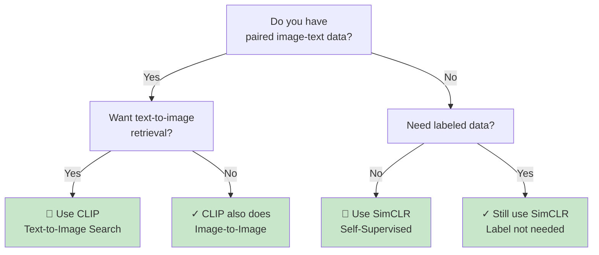

### How to Choose at Runtime

```bash
# Interactive selection
python train.py

# Command line selection
python train.py --model clip --scale medium --data coco_small

# Programmatic selection
from models import CLIPModel, SimCLRModel

# Choose based on data
if has_text_captions:
    model = CLIPModel()
else:
    model = SimCLRModel()
```

---

## High-Level Architecture

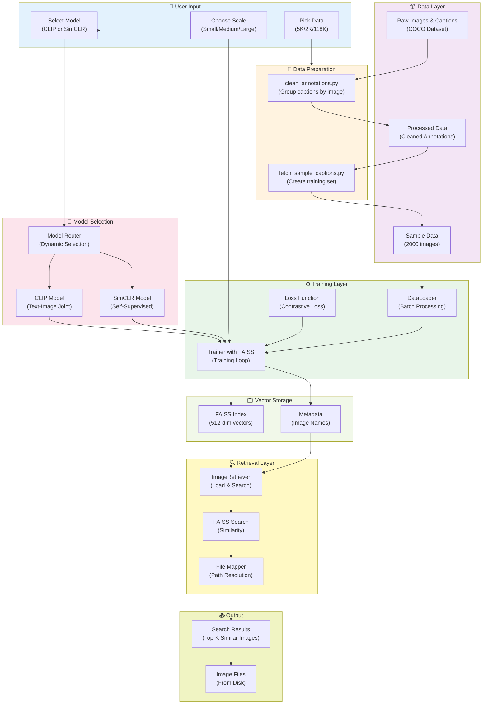

---

## Training Pipeline

### Detailed Training Flow

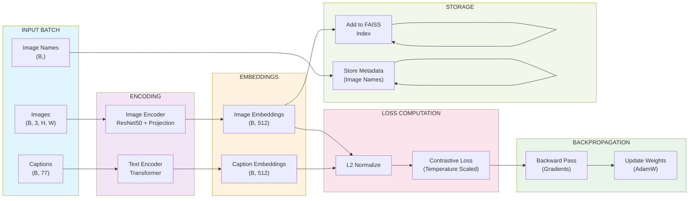

### Training Iteration Loop

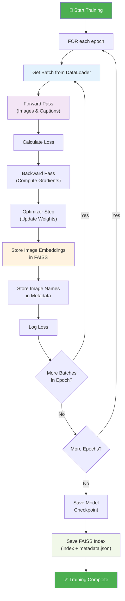

---

## Inference & Retrieval Pipeline

### Image Retrieval Flow


---

## Data Flow

### Complete End-to-End Data Flow

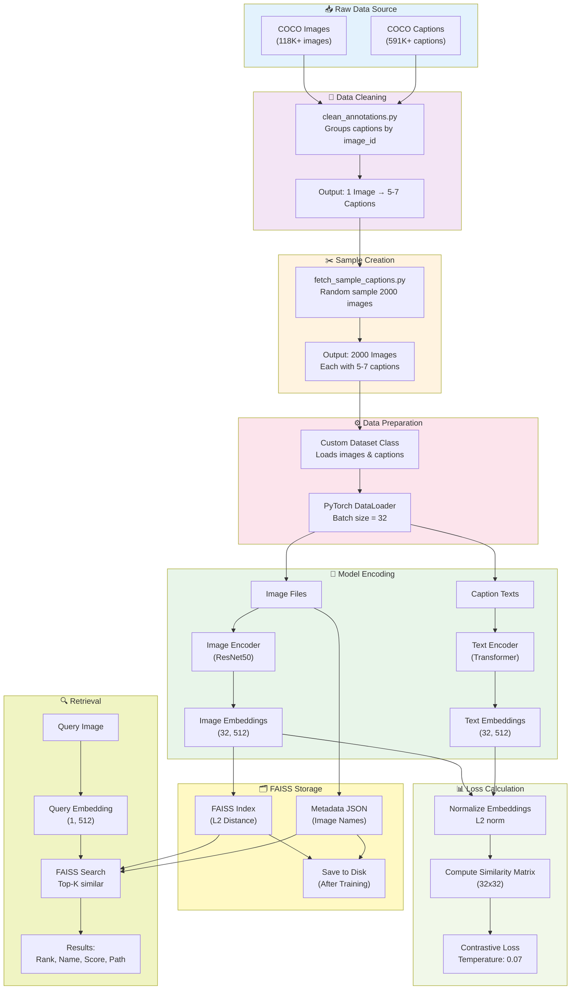

---

## Component Details

### 1. Image Encoder


### 2. Text Encoder


### 3. CLIP Model

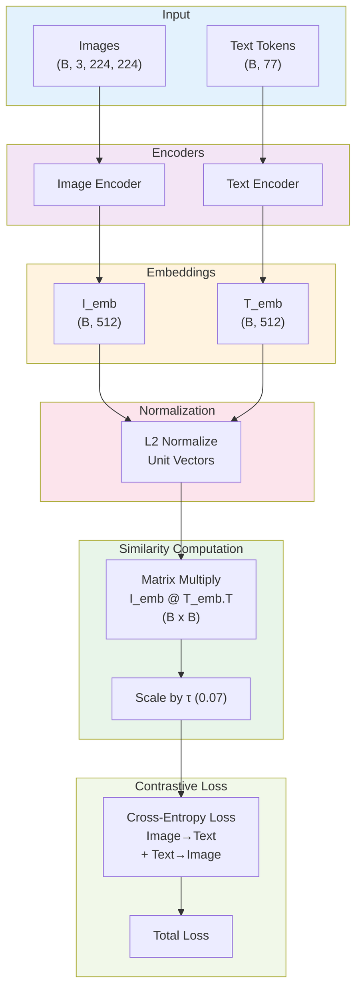

### 4. FAISS Vector Store

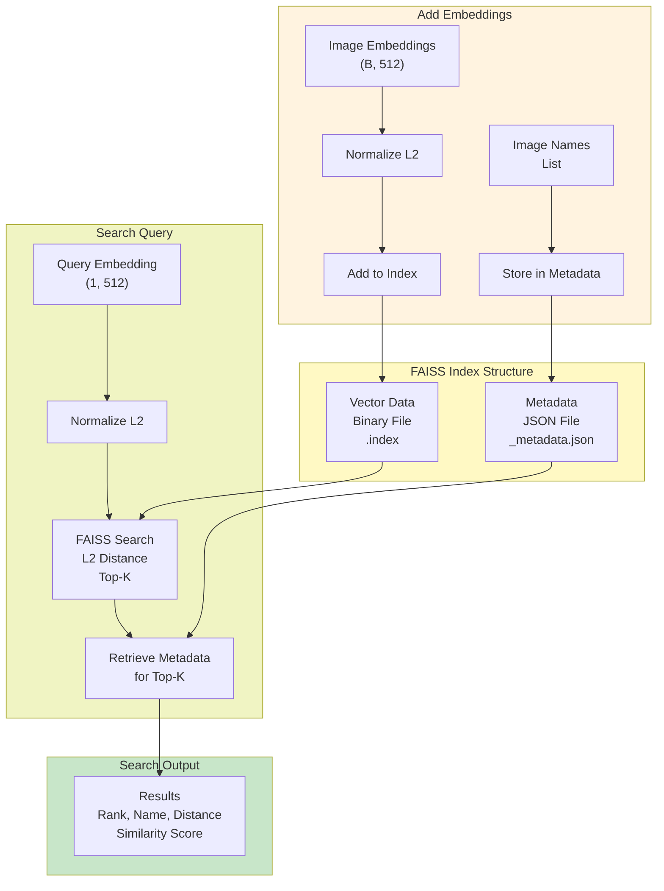

---

## File Structure

### Project Directory Layout

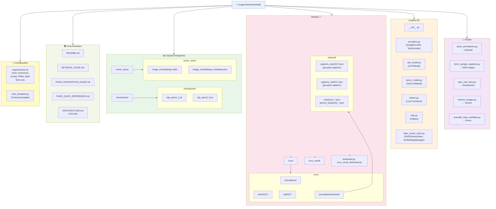

---

## Integration Points

### Training → Inference Pipeline

```mermaid
graph LR
    subgraph Training["⚙️ TRAINING PHASE"]
        TData["Load Data<br/>(2000 images)"]
        TModel["Initialize Model<br/>(CLIP)"]
        TTrainer["Create Trainer<br/>(CLIPTrainerWithFAISS)"]
        TLoop["Training Loop<br/>(num_epochs)"]
        TSaveModel["Save Model<br/>checkpoints/"]
        TSaveFAISS["Save FAISS<br/>vector_store/"]
    end
    
    subgraph Checkpoints["💾 CHECKPOINTS"]
        ModelFile["clip_epoch_N.pt<br/>(Model Weights)"]
        IndexFile["image_embeddings.index<br/>(FAISS Index)"]
        MetaFile["image_embeddings_metadata.json<br/>(Image Names)"]
    end
    
    subgraph Inference["🔍 INFERENCE PHASE"]
        ILoadModel["Load Model<br/>from checkpoint"]
        ILoadFAISS["Load FAISS Index<br/>& Metadata"]
        IRetriever["Create ImageRetriever"]
        IQuery["Query Image"]
        ISearch["Search FAISS"]
        IResults["Get Results"]
    end
    
    subgraph Usage["📤 USAGE"]
        DisplayResults["Display Top-K<br/>Similar Images"]
        LocateFiles["Locate Images<br/>on Disk"]
    end
    
    TData --> TModel
    TModel --> TTrainer
    TTrainer --> TLoop
    TLoop --> TSaveModel
    TLoop --> TSaveFAISS
    
    TSaveModel --> ModelFile
    TSaveFAISS --> IndexFile
    TSaveFAISS --> MetaFile
    
    ModelFile --> ILoadModel
    IndexFile --> ILoadFAISS
    MetaFile --> ILoadFAISS
    
    ILoadModel --> IRetriever
    ILoadFAISS --> IRetriever
    
    IRetriever --> IQuery
    IQuery --> ISearch
    ISearch --> IResults
    
    IResults --> DisplayResults
    IResults --> LocateFiles
    
    style Training fill:#c8e6c9
    style Checkpoints fill:#fff9c4
    style Inference fill:#ffccbc
    style Usage fill:#b3e5fc
```

### Module Dependencies

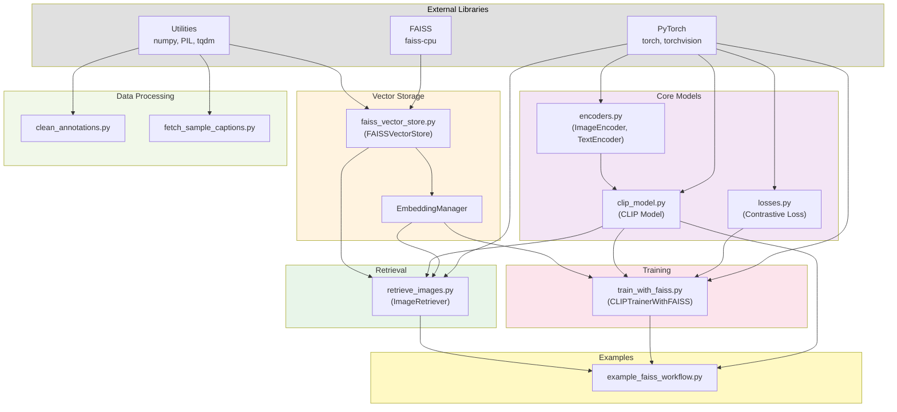

---

## Key Workflows

### Workflow 1: End-to-End Training

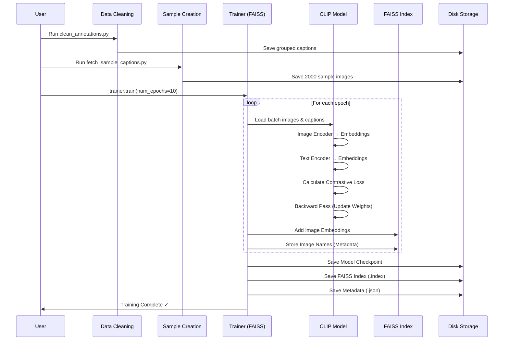

### Workflow 2: Image Search & Retrieval

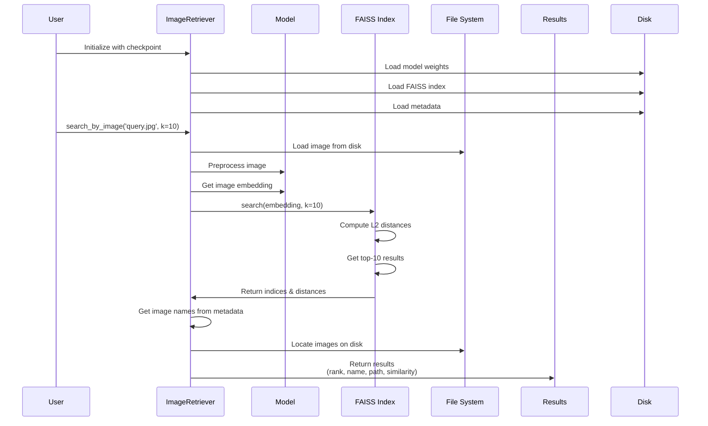

---

## Data Structures

### Batch Format (DataLoader)

```python
batch = {
    'images': torch.Tensor,           # Shape: (32, 3, 224, 224)
    'text_tokens': torch.Tensor,      # Shape: (32, 77)
    'text_mask': torch.Tensor,        # Shape: (32, 77)
    'image_names': List[str]          # ['img_001.jpg', 'img_002.jpg', ...]
}
```

### FAISS Metadata Structure

```json
{
  "embedding_dim": 512,
  "num_vectors": 2000,
  "image_names": [
    "image_000001.jpg",
    "image_000002.jpg",
    ...
    "image_002000.jpg"
  ]
}
```

### Search Result Format

```python
result = {
    'rank': 1,                    # Rank in results
    'image_name': 'img_001.jpg',  # Image identifier
    'distance': 0.0234,           # L2 distance (lower = better)
    'similarity': 0.977,          # Normalized similarity (0-1)
    'found_on_disk': True,        # Whether file exists
    'disk_path': '/path/to/img'   # Full file path
}
```

### Model Output

```python
image_embeddings, text_embeddings = model(
    images,        # (B, 3, 224, 224)
    text_tokens,   # (B, 77)
    text_mask      # (B, 77)
)
# image_embeddings: (B, 512)
# text_embeddings: (B, 512)
```

---

## Configuration Summary

### Training Configuration

```python
config = {
    'embedding_dim': 512,
    'text_max_seq_length': 77,
    'vocab_size': 10000,
    'num_text_layers': 12,
    'num_text_heads': 8,
    'batch_size': 32,
    'learning_rate': 1e-4,
    'weight_decay': 1e-6,
    'num_epochs': 10,
    'temperature': 0.07,          # For contrastive loss
    'checkpoint_interval': 1,      # Save every N epochs
    'vector_store_dir': 'vector_store'
}
```

### FAISS Configuration

```python
faiss_config = {
    'embedding_dim': 512,
    'index_type': 'IndexFlatL2',   # Can upgrade to IndexIVFFlat
    'index_path': 'vector_store/image_embeddings.index',
    'metadata_path': 'vector_store/image_embeddings_metadata.json',
    'normalize': True              # L2 normalize vectors
}
```

---

## Summary

Your architecture consists of:

1. **Data Pipeline**: Raw COCO → Cleaned → Sampled (2000 images)
2. **Model Pipeline**: Images & Captions → Encoders → 512-dim Embeddings
3. **Loss Pipeline**: Contrastive loss between image and text embeddings
4. **Storage Pipeline**: Embeddings → FAISS Index + Metadata
5. **Retrieval Pipeline**: Query Image → Embedding → FAISS Search → Results

This creates a scalable, efficient image retrieval system that can handle millions of images while maintaining fast search capabilities!
