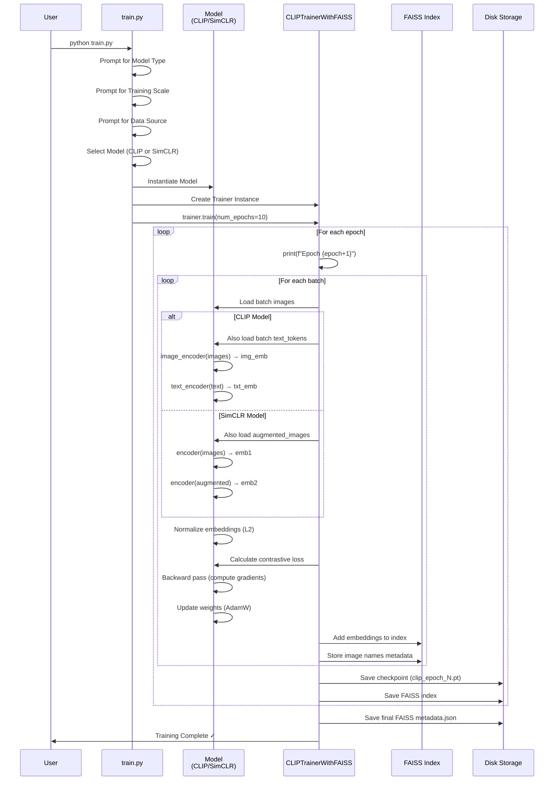
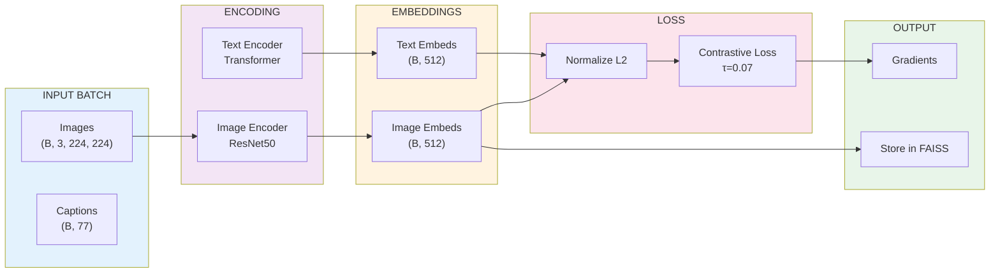
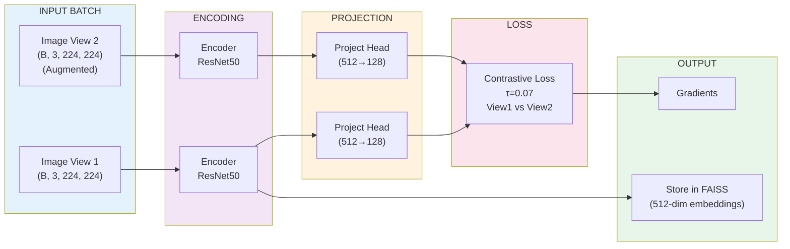
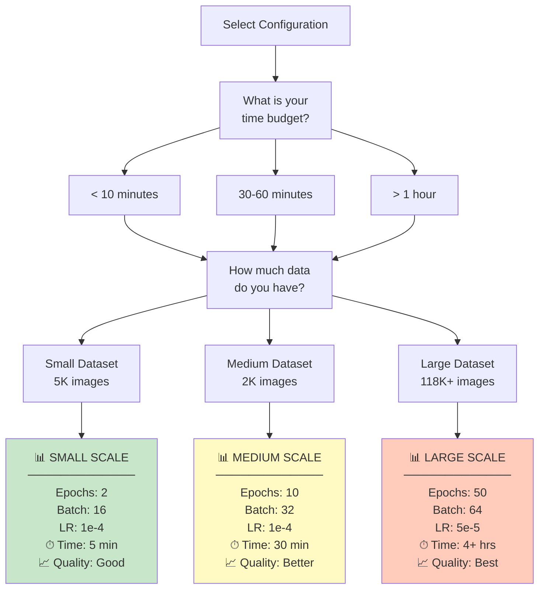
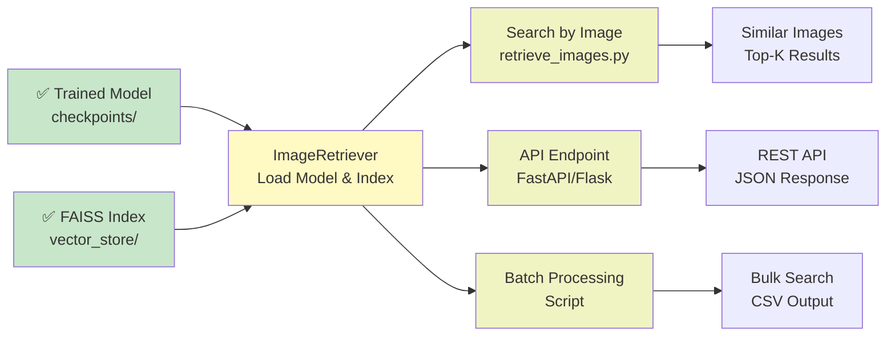
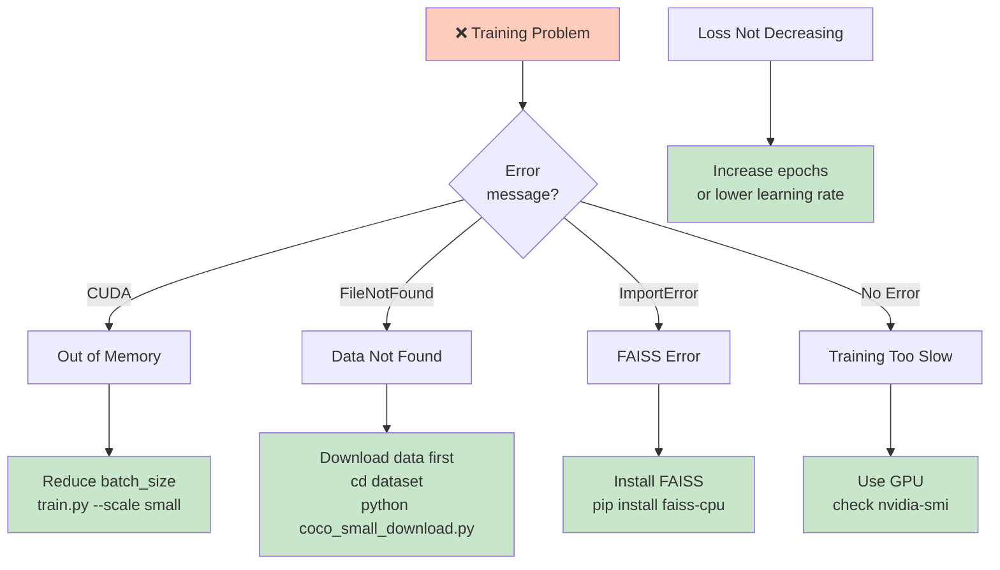

# Complete Training Workflow

## System Architecture with Model Selection

```mermaid
graph TB
    Start["🚀 python train.py<br/>(Start Interactive Training)"]
    
    subgraph UserSelection["👤 USER SELECTION (Interactive)"]
        Q1["1️⃣ Select Model Type"]
        Q2["2️⃣ Choose Training Scale"]
        Q3["3️⃣ Pick Data Source"]
    end
    
    subgraph ModelChoice["🧠 MODEL SELECTION"]
        CLIP["CLIP Model<br/>Text-to-Image<br/>───────────<br/>• ImageEncoder<br/>• TextEncoder<br/>• Joint Loss"]
        SIMCLR["SimCLR Model<br/>Image-to-Image<br/>───────────<br/>• Single Encoder<br/>• Augmentation<br/>• Contrastive Loss"]
        Router["Model Router<br/>Instantiate<br/>Selected Model"]
    end
    
    subgraph DataPrep["📂 DATA PREPARATION"]
        Validate["Validate Data<br/>Exists on Disk"]
        Load["Load DataLoaders<br/>Batch Processing"]
        Config["Create Config<br/>Save to JSON"]
    end
    
    subgraph TrainingPhase["⚙️ TRAINING PHASE"]
        Init["Initialize Model<br/>& Trainer"]
        TrainLoop["🔄 Training Loop"]
        
        subgraph EpochLoop["For each Epoch"]
            BatchLoop["For each Batch"]
            
            subgraph BatchOps["Batch Operations"]
                Forward["Forward Pass<br/>(Get Embeddings)"]
                Loss["Calculate Loss<br/>(Contrastive)"]
                Backward["Backward Pass<br/>(Gradients)"]
                Update["Update Weights<br/>(AdamW)"]
            end
            
            Store["Store Embeddings<br/>in FAISS"]
            Log["Log Metrics"]
            CheckDone{"More<br/>Batches?"}
        end
        
        CheckEpoch{"More<br/>Epochs?"}
        SaveCheckpoint["Save Model<br/>Checkpoint"]
    end
    
    subgraph SavePhase["💾 PERSISTENCE"]
        SaveFAISS["Save FAISS Index<br/>• image_embeddings.index<br/>• image_embeddings_metadata.json"]
        FinalConfig["Save Final Config<br/>training_configs/"]
    end
    
    subgraph Output["📊 OUTPUT FILES"]
        Checkpoints["checkpoints/<br/>clip_epoch_N.pt"]
        VectorStore["vector_store/<br/>index + metadata"]
        Configs["training_configs/<br/>config.json"]
    end
    
    subgraph Retrieval["🔍 RETRIEVAL PHASE"]
        LoadModel["Load Model<br/>from Checkpoint"]
        LoadFAISS["Load FAISS Index<br/>& Metadata"]
        CreateRetriever["Create ImageRetriever"]
        QueryImage["Query Image"]
        FAISSSearch["FAISS Search<br/>L2 Distance → Top-K"]
        Results["Return Results<br/>Ranked by Similarity"]
    end
    
    Start --> Q1
    Q1 --> Q2
    Q2 --> Q3
    
    Q1 --> Router
    Router --> CLIP
    Router --> SIMCLR
    
    CLIP --> Validate
    SIMCLR --> Validate
    Q3 --> Validate
    
    Validate --> Load
    Load --> Config
    Config --> Init
    Q2 --> Init
    
    Init --> TrainLoop
    TrainLoop --> BatchLoop
    BatchLoop --> Forward
    Forward --> Loss
    Loss --> Backward
    Backward --> Update
    Update --> Store
    Store --> Log
    
    Log --> CheckDone
    CheckDone -->|Yes| BatchLoop
    CheckDone -->|No| CheckEpoch
    CheckEpoch -->|No| SaveCheckpoint
    CheckEpoch -->|Yes| SaveCheckpoint
    SaveCheckpoint --> CheckEpoch
    
    SaveCheckpoint --> SaveFAISS
    SaveFAISS --> FinalConfig
    
    FinalConfig --> Checkpoints
    FinalConfig --> VectorStore
    FinalConfig --> Configs
    
    Checkpoints --> LoadModel
    VectorStore --> LoadFAISS
    Configs --> CreateRetriever
    
    LoadModel --> CreateRetriever
    LoadFAISS --> CreateRetriever
    
    CreateRetriever --> QueryImage
    QueryImage --> FAISSSearch
    FAISSSearch --> Results
    
    style Start fill:#4caf50,color:#fff
    style UserSelection fill:#e3f2fd
    style ModelChoice fill:#f3e5f5
    style DataPrep fill:#fff3e0
    style TrainingPhase fill:#fce4ec
    style EpochLoop fill:#fff9c4
    style BatchOps fill:#f0f4c3
    style SavePhase fill:#e8f5e9
    style Output fill:#f1f8e9
    style Retrieval fill:#c8e6c9
```



---

## Detailed Training Loop Sequence



---

## Model-Specific Data Flows

### CLIP Training Flow



### SimCLR Training Flow



---

## Training Configuration Selection Logic



---

## Output Directory Structure After Training

```
project_root/
├── checkpoints/                    # 🎯 Model Weights
│   ├── clip_epoch_1.pt
│   ├── clip_epoch_2.pt
│   └── clip_epoch_10.pt            # ← Use this for inference
│
├── vector_store/                   # 🗂️ FAISS Indices
│   ├── image_embeddings.index      # Binary FAISS index
│   └── image_embeddings_metadata.json  # Image name mapping
│       {
│         "embedding_dim": 512,
│         "num_vectors": 2000,
│         "image_names": ["img1.jpg", "img2.jpg", ...]
│       }
│
├── training_configs/               # 📋 Configuration Records
│   └── clip_coco_small_config.json
│       {
│         "model_type": "clip",
│         "training": {
│           "epochs": 10,
│           "batch_size": 32,
│           "learning_rate": 1e-4
│         },
│         "model_params": {...}
│       }
└── logs/                          # 📊 Training Logs (optional)
    └── training_log.txt
```

---

## Complete Training Command Examples

### Example 1: First Time Users (Interactive)
```bash
python train.py
# Follow 3 simple prompts
```

### Example 2: Quick Test
```bash
python train.py --model clip --scale small --data coco_small --non-interactive
```

### Example 3: Development
```bash
python train.py --model clip --scale medium --data coco_small
```

### Example 4: Production
```bash
python train.py --model clip --scale large --data coco_full
```

### Example 5: Alternative Model
```bash
python train.py --model simclr --scale medium --data coco_small
```

---

## After Training: Usage Workflow



---

## Key Metrics to Monitor

During training, watch these metrics:

```python
Epoch 1, Batch 1/32, Loss: 3.2145
                      ↑
                  Contrastive Loss
                  Should decrease over batches/epochs
                  
✓ Training Loss: 2.9834       ← Overall epoch loss
✓ Validation Loss: 3.0123     ← Should be similar (no overfitting)

If Training Loss < Validation Loss by a lot → Model is overfitting
If Training Loss doesn't decrease → Learning rate too low
```

---

## Troubleshooting Flowchart



---

## Summary

✅ **Interactive Training** - `python train.py`  
✅ **Model Selection** - CLIP or SimCLR based on data  
✅ **Flexible Scaling** - Small/Medium/Large configs  
✅ **Automatic FAISS** - Embeddings stored during training  
✅ **Complete Documentation** - Guides for every step  

**Start training now:** `python train.py`
