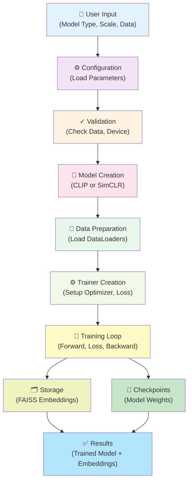
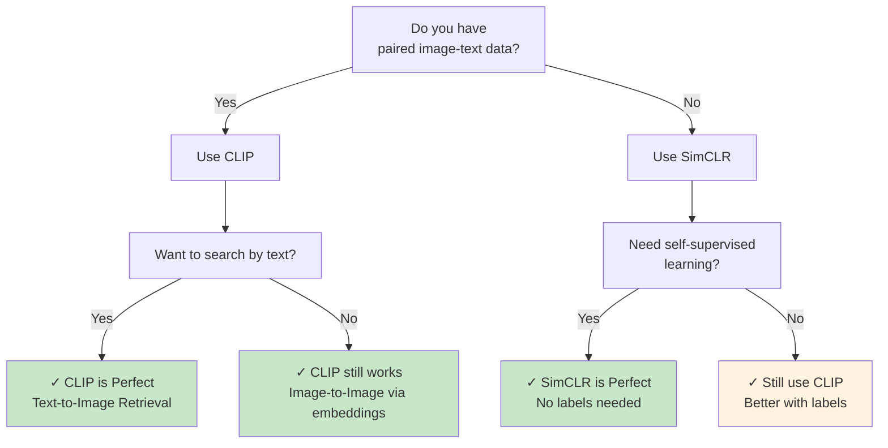

# Model Training Guide

## Table of Contents
1. [Quick Start](#quick-start)
2. [Training System Overview](#training-system-overview)
3. [Step-by-Step Training](#step-by-step-training)
4. [Model Selection](#model-selection)
5. [Training Configurations](#training-configurations)
6. [Data Sources](#data-sources)
7. [Advanced Usage](#advanced-usage)
8. [Troubleshooting](#troubleshooting)

---

## Quick Start

### Option 1: Interactive Mode (Recommended for Beginners)

```bash
# Start interactive training
python train.py
```

Follow the on-screen prompts to:
1. Select model type (CLIP or SimCLR)
2. Choose training scale (Small/Medium/Large)
3. Pick data source (5K / 2K / 118K+ images)
4. Confirm and start training

### Option 2: Command Line Mode

```bash
# Non-interactive training with specific configuration
python train.py --model clip --scale medium --data coco_small
```

### Option 3: Programmatic Mode

```python
from train_with_faiss import CLIPTrainerWithFAISS
from models import CLIPModel

# Create model
model = CLIPModel()

# Create trainer
trainer = CLIPTrainerWithFAISS(
    model=model,
    train_loader=train_loader,
    val_loader=val_loader,
    vector_store_dir='vector_store'
)

# Train
trainer.train(num_epochs=10, store_embeddings=True)
```

---

## Training System Overview



---

## Step-by-Step Training

### Step 1: Select Model Type

Two models are available:

#### **CLIP** - Contrastive Language-Image Pre-training
- **Use Case**: Text-to-Image retrieval
- **Input**: Images + Text captions (paired)
- **Output**: Joint embeddings (512-dim)
- **Best For**: 
  - Searching images by text description
  - Understanding image-text relationships
  - Cross-modal retrieval tasks

```python
from models import CLIPModel

model = CLIPModel(
    image_embedding_dim=512,
    text_embedding_dim=512,
    vocab_size=10000,
    text_max_seq_length=77,
    num_text_layers=12,
    num_text_heads=8,
)
```

#### **SimCLR** - Simple Contrastive Learning
- **Use Case**: Image-to-Image retrieval
- **Input**: Images only (no text needed)
- **Output**: Image embeddings (512-dim)
- **Best For**:
  - Self-supervised learning
  - Finding similar images
  - No manual annotation required

```python
from models import SimCLRModel

model = SimCLRModel(
    embedding_dim=512,
    projection_dim=128,
    hidden_dim=2048,
    num_negative=4096,
    temperature=0.07,
)
```

### Step 2: Choose Training Scale

```
┌─────────────────────────────────────────────────────────────┐
│                   TRAINING SCALES                           │
├──────────────┬─────────┬─────────────┬──────────────────────┤
│   Scale      │ Epochs  │ Batch Size  │ Use Case             │
├──────────────┼─────────┼─────────────┼──────────────────────┤
│ Small        │ 2       │ 16          │ Quick testing        │
│ Medium       │ 10      │ 32          │ Development          │
│ Large        │ 50      │ 64          │ Production           │
└──────────────┴─────────┴─────────────┴──────────────────────┘
```

### Step 3: Select Data Source

| Source | Images | Size | Use Case |
|--------|--------|------|----------|
| **COCO Small** | 5,000 | ~2GB | Fast testing, prototyping |
| **COCO Sample** | 2,000 | ~800MB | Development work |
| **COCO Full** | 118,000+ | ~40GB | Production training |

### Step 4: Prepare Data

Your data should be in format:

```python
batch = {
    'images': torch.Tensor,           # (batch_size, 3, 224, 224)
    'text_tokens': torch.Tensor,      # (batch_size, 77) [CLIP only]
    'text_mask': torch.Tensor,        # (batch_size, 77) [CLIP only]
    'image_names': List[str]          # ['img1.jpg', 'img2.jpg', ...]
}
```

### Step 5: Start Training

```bash
python train.py --model clip --scale medium --data coco_small
```

The training will:
1. Load data in batches
2. Forward pass through model
3. Calculate contrastive loss
4. Backward pass (update weights)
5. Store embeddings in FAISS
6. Save checkpoint at end of epoch
7. Display progress and metrics

### Step 6: Monitor Training

During training, you'll see:

```
================================================================================
  CLIP Model Training with FAISS Vector Store
================================================================================

Epoch 1/10
────────────────────────────────────────────────────────────────────────────
Epoch 1, Batch 1/32, Loss: 3.2145
Epoch 1, Batch 2/32, Loss: 3.1856
...
✓ Training Loss: 2.9834
✓ Validation Loss: 3.0123
✓ Checkpoint saved: checkpoints/clip_epoch_1.pt

Epoch 2/10
────────────────────────────────────────────────────────────────────────────
...
```

### Step 7: Access Results

After training completes:

**Saved Files:**
```
checkpoints/
├── clip_epoch_1.pt          # Model weights
├── clip_epoch_2.pt
└── clip_epoch_10.pt         # Final model

vector_store/
├── image_embeddings.index           # FAISS index
└── image_embeddings_metadata.json   # Image names

training_configs/
└── clip_coco_small_config.json      # Configuration
```

---

## Model Selection

### Decision Tree



### Comparison Table

| Aspect | CLIP | SimCLR |
|--------|------|--------|
| **Input** | Images + Text | Images only |
| **Learning** | Supervised (labels) | Self-supervised |
| **Embeddings** | Image + Text | Image only |
| **Retrieval** | Text-to-Image | Image-to-Image |
| **Training Time** | Longer | Shorter |
| **Data Requirements** | Paired images/text | Any images |
| **Use Case** | Semantic search | Similarity search |

---

## Training Configurations

### Small Scale (Quick Testing)

```python
{
    'num_epochs': 2,
    'batch_size': 16,
    'learning_rate': 1e-4,
    'weight_decay': 1e-6,
}
```

**Use When:**
- Testing new code
- Prototyping ideas
- Limited time/resources

**Training Time:** ~5-10 minutes (on GPU)

### Medium Scale (Development)

```python
{
    'num_epochs': 10,
    'batch_size': 32,
    'learning_rate': 1e-4,
    'weight_decay': 1e-6,
}
```

**Use When:**
- Developing models
- Iterating on ideas
- Need reasonable performance

**Training Time:** ~30-60 minutes (on GPU)

### Large Scale (Production)

```python
{
    'num_epochs': 50,
    'batch_size': 64,
    'learning_rate': 5e-5,
    'weight_decay': 1e-6,
}
```

**Use When:**
- Production deployment
- Need best performance
- Have computational resources

**Training Time:** ~4-8 hours (on GPU)

---

## Data Sources

### Setting Up Data

#### 1. Small Dataset (5,000 images)

```bash
cd dataset
python coco_small_download.py
```

Downloaded to: `dataset/coco_small/`

#### 2. Medium Dataset (2,000 images sampled)

First download small or full dataset, then:

```bash
python fetch_sample_captions.py
```

Creates: `dataset/coco/annotations/cleaned/captions_train2017_sample_2000.json`

#### 3. Full Dataset (118,000+ images)

```bash
cd dataset
python download.py
```

Downloaded to: `dataset/coco/`

Then clean annotations:

```bash
python clean_annotations.py
```

Creates: `dataset/coco/annotations/cleaned/`

---

## Advanced Usage

### Custom Dataset

Create your own dataset class:

```python
from torch.utils.data import Dataset
import json
from PIL import Image
import torchvision.transforms as transforms

class CustomDataset(Dataset):
    def __init__(self, images_dir, captions_file):
        self.images_dir = images_dir
        self.transform = transforms.Compose([
            transforms.Resize((224, 224)),
            transforms.ToTensor(),
            transforms.Normalize(
                mean=[0.485, 0.456, 0.406],
                std=[0.229, 0.224, 0.225]
            )
        ])
        
        # Load captions
        with open(captions_file) as f:
            self.data = json.load(f)['annotations']
    
    def __len__(self):
        return len(self.data)
    
    def __getitem__(self, idx):
        item = self.data[idx]
        
        # Load image
        image_path = f"{self.images_dir}/{item['image_name']}"
        image = Image.open(image_path).convert('RGB')
        image = self.transform(image)
        
        # Get captions (if available)
        captions = item.get('captions', [''])
        caption_text = ' '.join(captions[:5])  # Use first 5 captions
        
        return {
            'images': image,
            'text': caption_text,
            'image_names': item['image_name']
        }
```

### Custom Training Loop

```python
from train_with_faiss import CLIPTrainerWithFAISS
from models import CLIPModel

# Initialize
model = CLIPModel()
trainer = CLIPTrainerWithFAISS(
    model=model,
    train_loader=train_loader,
    val_loader=val_loader,
    learning_rate=5e-5,  # Custom learning rate
    vector_store_dir='my_vector_store',
    embedding_dim=512,
)

# Custom training with early stopping
best_loss = float('inf')
patience = 5
patience_counter = 0

for epoch in range(50):
    train_loss = trainer.train_epoch(epoch=epoch, store_embeddings=True)
    val_loss = trainer.val_epoch()
    
    print(f"Epoch {epoch+1}: Train Loss={train_loss:.4f}, Val Loss={val_loss:.4f}")
    
    # Early stopping
    if val_loss < best_loss:
        best_loss = val_loss
        patience_counter = 0
        trainer.save_checkpoint(epoch + 1)
    else:
        patience_counter += 1
        if patience_counter >= patience:
            print("Early stopping triggered")
            break

# Save FAISS indices
trainer.embedding_manager.save_all_indices()
```

### Resume Training

```python
# Load checkpoint
checkpoint = torch.load('checkpoints/clip_epoch_5.pt')
model.load_state_dict(checkpoint)

# Continue training
trainer = CLIPTrainerWithFAISS(model, train_loader, val_loader)
trainer.embedding_manager.load_all_indices()  # Load FAISS

# Resume from epoch 5
for epoch in range(5, 10):
    trainer.train_epoch(epoch=epoch, store_embeddings=True)
```

### Distributed Training

```python
import torch.distributed as dist
from torch.nn.parallel import DistributedDataParallel as DDP

# Initialize
dist.init_process_group("nccl")
rank = dist.get_rank()
torch.cuda.set_device(rank)

# Wrap model
model = model.to(rank)
model = DDP(model, device_ids=[rank])

# Create distributed trainer
trainer = CLIPTrainerWithFAISS(model, train_loader_dist, val_loader_dist)
trainer.train(num_epochs=50)
```

---

## Troubleshooting

### Issue: "CUDA out of memory"

**Solution:** Reduce batch size

```bash
python train.py --model clip --scale small --data coco_small
```

Or programmatically:

```python
train_config['batch_size'] = 8  # Reduce from 32
```

### Issue: "Data not found"

**Solution:** Download data first

```bash
cd dataset
python coco_small_download.py
```

Verify location:
```
dataset/
├── coco_small/
│   └── images/
│       └── val2017/
└── coco/
    └── annotations/
        └── cleaned/
```

### Issue: "Model training is slow"

**Solution:** Use GPU

```python
device = torch.device('cuda' if torch.cuda.is_available() else 'cpu')
trainer = CLIPTrainerWithFAISS(..., device=device)
```

Check GPU usage:
```bash
nvidia-smi
```

### Issue: "FAISS not found"

**Solution:** Install FAISS

```bash
# CPU version
pip install faiss-cpu

# GPU version (requires CUDA)
pip install faiss-gpu
```

### Issue: "Model accuracy not improving"

**Solution:** Adjust hyperparameters

```python
# Lower learning rate
config['learning_rate'] = 5e-5

# Increase epochs
config['num_epochs'] = 50

# Use warmup
from torch.optim.lr_scheduler import OneCycleLR
scheduler = OneCycleLR(optimizer, max_lr=1e-4, total_steps=num_steps)
```

### Issue: "Memory error during FAISS search"

**Solution:** Use approximate FAISS index

```python
# In faiss_vector_store.py, replace:
# self.index = faiss.IndexFlatL2(embedding_dim)

# With:
nlist = 100
self.index = faiss.IndexIVFFlat(
    faiss.IndexFlatL2(embedding_dim),
    embedding_dim,
    nlist
)
self.index.train(all_vectors)  # Train on sample
```

---

## Performance Tips

### For Faster Training

1. **Increase batch size** (if GPU memory allows)
   ```python
   config['batch_size'] = 64
   ```

2. **Use mixed precision**
   ```python
   from torch.cuda.amp import autocast, GradScaler
   scaler = GradScaler()
   with autocast():
       loss = model(...)
   ```

3. **Use data prefetching**
   ```python
   train_loader = DataLoader(
       dataset, 
       batch_size=32,
       num_workers=4,  # Increase workers
       pin_memory=True
   )
   ```

### For Better Results

1. **Longer training**
   ```python
   config['num_epochs'] = 100
   ```

2. **Learning rate scheduling**
   ```python
   scheduler = CosineAnnealingLR(optimizer, T_max=100)
   ```

3. **Data augmentation**
   ```python
   transforms.RandomHorizontalFlip()
   transforms.ColorJitter(brightness=0.2)
   ```

---

## Next Steps After Training

1. **Evaluate Model**
   ```bash
   python retrieve_images.py --model checkpoints/clip_epoch_10.pt
   ```

2. **Search Similar Images**
   ```python
   from retrieve_images import ImageRetriever
   retriever = ImageRetriever('checkpoints/clip_epoch_10.pt', 'vector_store')
   results = retriever.search_by_image('query.jpg', k=10)
   ```

3. **Deploy Model**
   - Use FastAPI/Flask for REST API
   - Deploy with Docker
   - Use ONNX for inference optimization

---

## Summary

The training system provides:

✅ **Easy to use** - Interactive or command-line mode  
✅ **Flexible** - Choose model, scale, and data  
✅ **Integrated** - Automatic FAISS embedding storage  
✅ **Scalable** - From quick tests to production training  
✅ **Configurable** - Full control over parameters  

Start with `python train.py` and follow the prompts!
